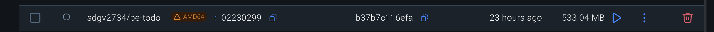
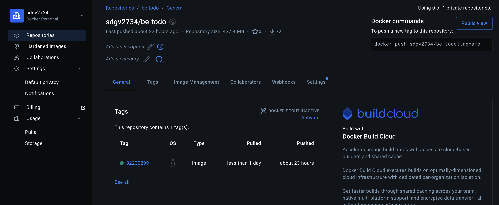
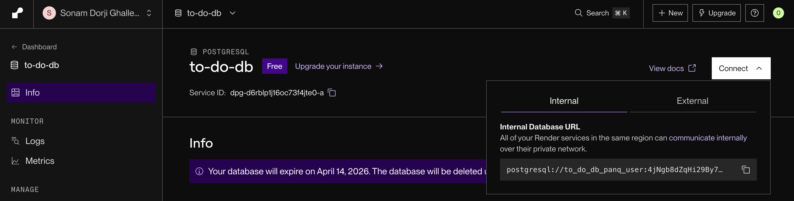
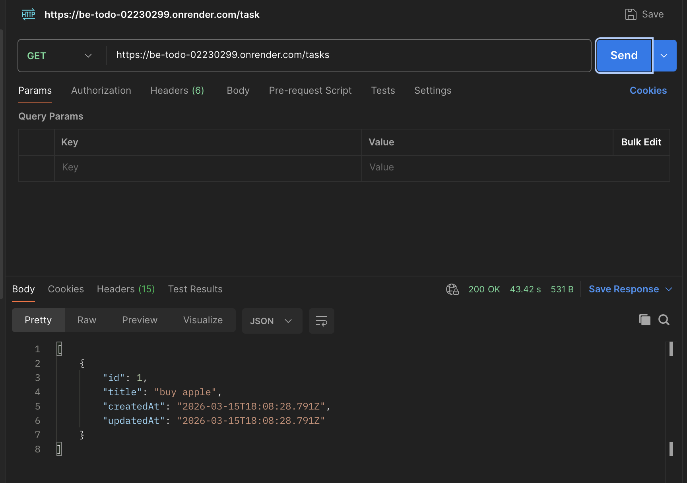
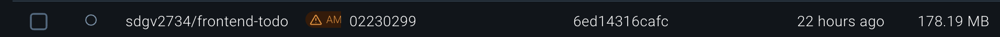
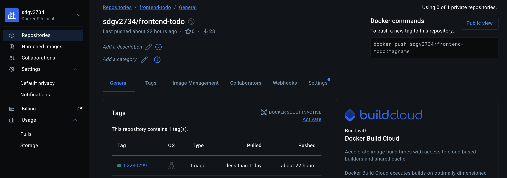
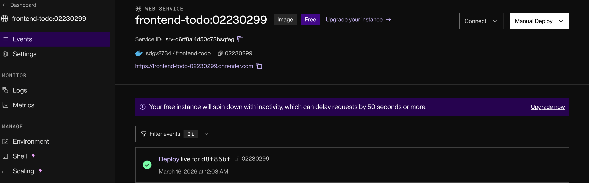
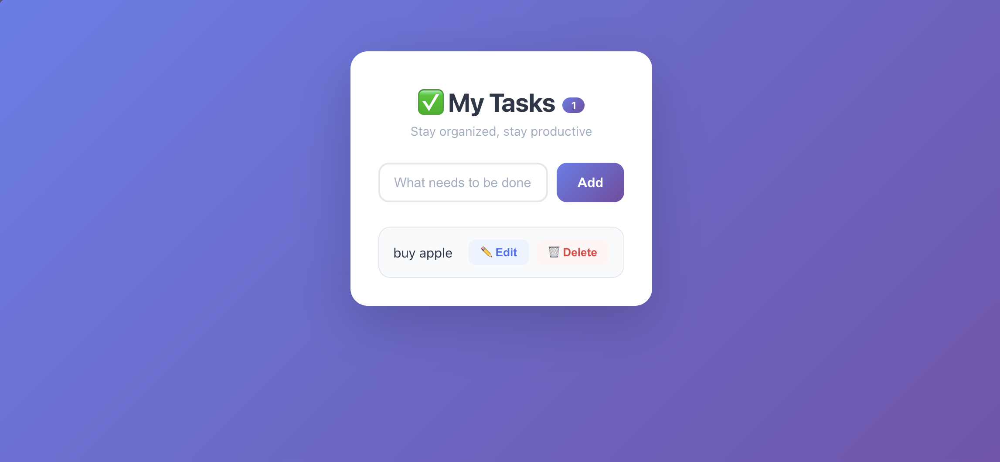

# DSO101 – Assignment 1
## Containerised Full-Stack To-Do Application

**Student Name:** SONAM DORJI GHALLEY  
**Student ID:** 02230299  

---

# 1. Introduction

This project demonstrates the development, containerisation, and deployment of a full‑stack To‑Do application using modern DevOps practices.

The system includes:

- Frontend: React.js
- Backend: Node.js with Express
- Database: PostgreSQL
- ORM: Prisma
- Containerisation: Docker
- Cloud Deployment: Render
- Version Control: GitHub

The application allows users to create, read, update, and delete tasks.

---

# 2. Technology Stack

| Layer | Technology |
|------|-------------|
| Frontend | React |
| Backend | Node.js + Express |
| Database | PostgreSQL |
| ORM | Prisma |
| Containerisation | Docker |
| Cloud Deployment | Render |
| CI/CD | Render Blueprint |
| Version Control | Git + GitHub |

---

# 3. System Architecture

```
+---------------------------+
|        React Client       |
|        (Frontend)         |
+------------+--------------+
             |
        HTTP REST API
             |
+------------v--------------+
|      Express Backend      |
|       Node.js Server      |
+------------+--------------+
             |
          Prisma ORM
             |
+------------v--------------+
|        PostgreSQL         |
|         Database          |
+---------------------------+
```

---

# 4. Project Directory Structure

```
studentname_studentnumber_DSO101_A1/

├── backend/
│   ├── Dockerfile
│   ├── package.json
│   ├── server.js
│   ├── prisma/
│   │   ├── schema.prisma
│   │   └── migrations/
│
├── frontend/
│   ├── Dockerfile
│   ├── package.json
│   └── src/
│
├── render.yaml
└── README.md
```

---

# 5. Backend Implementation

The backend is implemented using Node.js and Express.js.

## Backend API Endpoints

| Method | Endpoint | Description |
|------|------|------|
| GET | `/tasks` | Retrieve all tasks |
| POST | `/tasks` | Create new task |
| PUT | `/tasks/:id` | Update task |
| DELETE | `/tasks/:id` | Delete task |

---

# 6. Database Schema (Prisma)

```
model Task {
  id        Int     @id @default(autoincrement())
  title     String
  completed Boolean @default(false)
}
```

---

# 7. Backend Containerisation

## Backend Dockerfile

```
FROM node:22-alpine

WORKDIR /app

COPY package*.json ./
RUN npm install

COPY prisma ./prisma
RUN npx prisma generate

COPY . .

EXPOSE 5000

CMD ["sh", "-c", "npx prisma migrate deploy && node app.js"]
```

---

# 8. Backend Docker Build

```
docker build -t dockerhubusername/be-todo:studentid ./backend
```

### After the image is built, we should see something like this on docker desktop



---

# 9. Backend Docker Hub Push

```
docker push dockerhubusername/be-todo:studentid
```

### After pushing the image, it should be visible in your Docker Hub repository



---

# 10. Backend Deployment on Render

Environment variables:

```
DATABASE_URL=PostgreSQL connection string
PORT=5000
```

#### connection string on render for the database service should look something like this:



---

# 11. Backend API Testing

Example endpoint:

```
https://backend-service-url.onrender.com/tasks
```

#### backend checking on post-man should return a list of tasks (empty array if no tasks created yet):



---

# 12. Frontend Implementation

The frontend is built using React and communicates with the backend API.

Example API call:

```
axios.get(`${process.env.REACT_APP_API_URL}/tasks`)
```

---

# 13. Frontend Environment Configuration

```
REACT_APP_API_URL=https://backend-service-url.onrender.com
```

---

# 14. Frontend Containerisation

## Frontend Dockerfile

```
FROM node:22-alpine AS build

WORKDIR /app

COPY package*.json ./
RUN npm install

COPY . .

RUN npm run build

FROM node:22-alpine

WORKDIR /app

RUN npm install -g serve

COPY --from=build /app/build ./build

EXPOSE 3000

CMD ["serve", "-s", "build", "-l", "3000"]
```

---

# 15. Frontend Docker Build

```
docker build -t dockerhubusername/fe-todo:studentid ./frontend
```

#### After the image is built, we should see something like this on docker desktop



---

# 16. Frontend Docker Hub

```
docker push dockerhubusername/fe-todo:studentid
```

### After pushing the image, it should be visible in your Docker Hub repository



---

# 17. Frontend Deployment on Render

### 



---

# 18. Container Architecture

```
+----------------------+
|   React Container    |
|    (Frontend)        |
+----------+-----------+
           |
       REST API
           |
+----------v-----------+
|  Express Container   |
|      (Backend)       |
+----------+-----------+
           |
        Prisma ORM
           |
+----------v-----------+
|  PostgreSQL Service  |
|       (Render)       |
+----------------------+
```

---

# 19. Render Blueprint Deployment

## render.yaml

```
services:
  - type: web
    name: be-todo
    env: docker
    plan: free
    dockerfilePath: ./backend/Dockerfile
    dockerContext: ./backend
    envVars:
      - key: DATABASE_URL
        value: postgresql://to_do_db_panq_user:4jNgb8dZqHi29By7NXaxe.......
        sync: true
      - key: PORT
        value: 5000

  - type: web
    name: fe-todo
    env: docker
    plan: free
    dockerfilePath: ./frontend/Dockerfile
    dockerContext: ./frontend
    envVars:
      - key: REACT_APP_API_URL
        value: https://be-todo-02230299.onrender.com

```

---

# 20. Deployment Pipeline

```
Developer
   |
   | Git Push
   v
GitHub Repository
   |
   v
Render Blueprint
   |
Docker Image Build
   |
Container Deployment
   |
Live Application
```

---

# 21. Automatic Deployment Test

```
git add .
git commit -m "Test auto deploy"
git push
```

#### working automatic deployment should trigger a new build and deploy the updated application. After the deployment is complete, visiting the frontend URL should reflect the changes.




---

# 22. Repository

ADD YOUR GITHUB REPOSITORY LINK

---

# 23. Live Application Links

Frontend URL:

https://frontend-todo-02230299.onrender.com

Backend:

 Backend URL

https://be-todo-02230299.onrender.com

---

# 24. Conclusion

This project demonstrates a full DevOps workflow including application development, containerisation using Docker, and deployment using Render with automated CI/CD pipelines.
