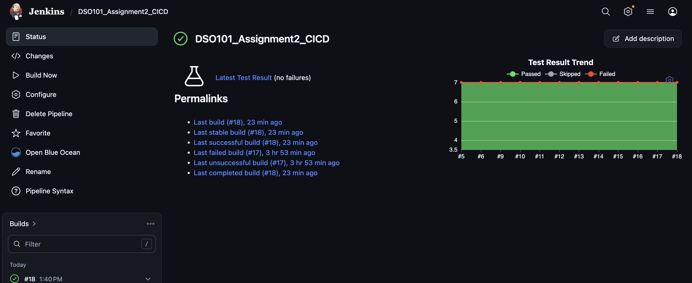
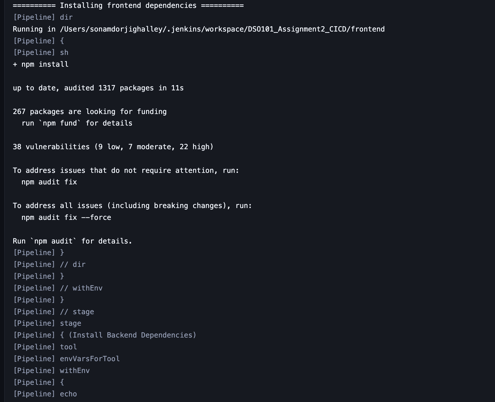
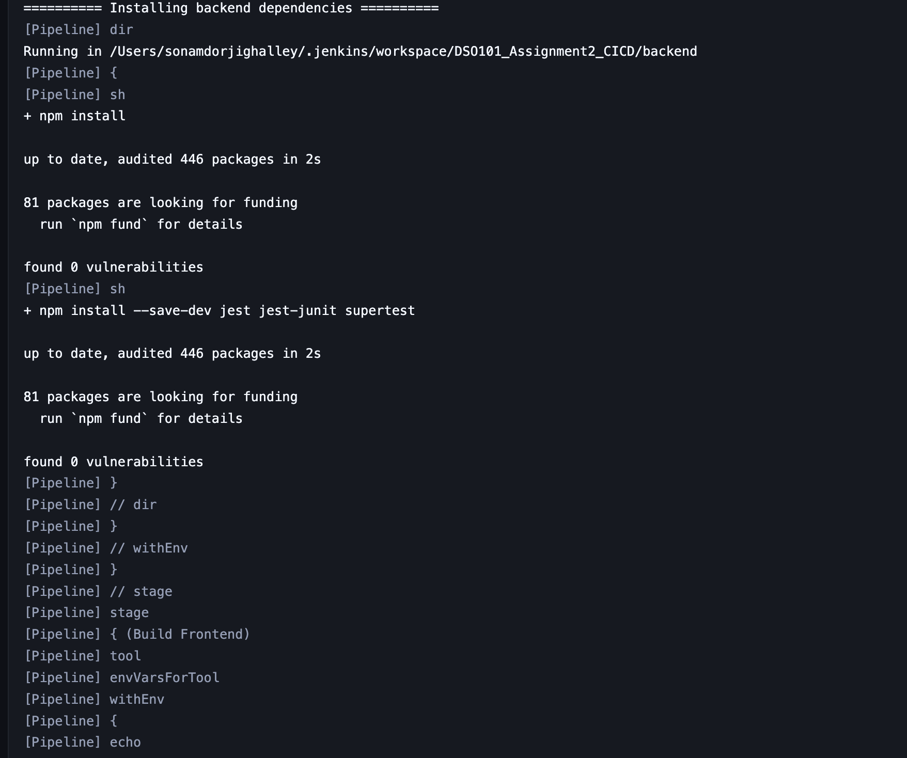

# DSO101 Assignment 3: DockerHub, GitHub Actions, and Render Deployment

$$
\huge \begin{array}{c} \mathbf{\textsf{Royal University of Bhutan,}} \\ \mathbf{\textsf{College of Science and Technology}} \end{array}
$$

$$
\Large \mathbf{\textsf{Computing Technologies Department  }}
$$

$$
\Large \mathbf{\textsf{Continuous Integration and Continuous Deployment DSO101}}
$$

$$
\large \mathbf{\textsf{Submitted by: Sonam Dorji Ghalley  }}
$$

$$
\large \mathbf{\textsf{Student No: 02230299  }}
$$

## Project Overview

This assignment demonstrates the containerization and deployment of a full-stack To-Do application using DockerHub, GitHub Actions, and Render. The objective was to establish a reproducible deployment workflow in which the application is packaged as a Docker image, published to a container registry, and deployed automatically through a continuous integration and continuous deployment pipeline.

The implemented workflow improves consistency between local and production environments, reduces manual deployment effort, and ensures that each deployment is based on a tested Docker image.

## Technology Stack

| Component | Technology Used |
|---|---|
| Frontend | React |
| Backend | Node.js, Express, Prisma |
| Database | PostgreSQL |
| Containerization | Docker |
| Image Registry | DockerHub |
| CI/CD Automation | GitHub Actions |
| Cloud Deployment | Render |

## Implementation Process

### 1. Verification of Package Scripts

The backend `package.json` file was reviewed to confirm that the application includes a production start command:

```json
"start": "node app.js"
```

A standardized test command was also added using the built-in Node.js test runner:

```json
"test": "node --test"
```

This ensures that both Docker builds and the CI/CD pipeline can execute a consistent quality check before the image is published.

### 2. Production Dockerfile Configuration

A root-level `Dockerfile` was created using the required `node:20-alpine` base image. The Dockerfile uses a multi-stage build to compile the React frontend and prepare the Node.js backend for production deployment.

The Dockerfile performs the following operations:

- Builds the React frontend in a dedicated build stage.
- Installs backend dependencies inside the production image.
- Generates the Prisma client.
- Runs the backend test suite during the Docker build.
- Copies the frontend build output into the backend public directory.
- Exposes port `3000` and starts the Express server with `npm start`.

```dockerfile
FROM node:20-alpine AS frontend-builder

WORKDIR /frontend

COPY frontend/package*.json ./
RUN npm install

COPY frontend/. .

ENV REACT_APP_API_URL=
ENV WATCHMAN=false
RUN npm test -- --watchAll=false --watchman=false
RUN npm run build

FROM node:20-alpine

WORKDIR /app

COPY backend/package*.json ./
RUN npm install

COPY backend/. .

RUN npx prisma generate
RUN npm test

COPY --from=frontend-builder /frontend/build ./public

ENV PORT=3000
EXPOSE 3000

CMD ["npm", "start"]
```

### 3. GitHub Actions Workflow

The workflow file `.github/workflows/deploy.yml` was created to automate the build and deployment process whenever changes are pushed to the `assignment-3` branch.

The workflow carries out the following steps:

1. Checks out the repository source code.
2. Authenticates with DockerHub using GitHub repository secrets.
3. Builds the Docker image and tags it as `<dockerhub-username>/todo-app:latest`.
4. Pushes the image to DockerHub.
5. Triggers a Render deployment through a secure deploy hook.

```yaml
name: Build and Deploy to Render

on:
  push:
    branches:
      - assignment-3

jobs:
  build-and-deploy:
    runs-on: ubuntu-latest

    steps:
      - name: Checkout Repository
        uses: actions/checkout@v4

      - name: Login to DockerHub
        uses: docker/login-action@v3
        with:
          username: ${{ secrets.DOCKERHUB_USERNAME }}
          password: ${{ secrets.DOCKERHUB_TOKEN }}

      - name: Build & Push Docker Image
        run: |
          docker build -t ${{ secrets.DOCKERHUB_USERNAME }}/todo-app:latest .
          docker push ${{ secrets.DOCKERHUB_USERNAME }}/todo-app:latest

      - name: Trigger Render Deployment
        run: curl -X POST "${{ secrets.RENDER_DEPLOY_HOOK_URL }}"
```

### 4. Repository Secrets Configuration

The required credentials were stored securely as GitHub repository secrets under:

```text
Settings > Secrets and variables > Actions > New repository secret
```

| Secret Name | Purpose |
|---|---|
| `DOCKERHUB_USERNAME` | Stores the DockerHub username used for image tagging and registry authentication. |
| `DOCKERHUB_TOKEN` | Stores the DockerHub access token used for secure authentication. |
| `RENDER_DEPLOY_HOOK_URL` | Stores the Render deploy hook URL used to trigger deployment after a successful image push. |

Using repository secrets prevents sensitive credentials from being hardcoded in the workflow file or committed to version control.

### 5. Render Deployment Configuration

The Render web service was configured to deploy the Docker image published to DockerHub:

```text
sdgv2734/todo-app:latest
```

After the Render service was configured, the deploy hook URL was copied from Render and stored in GitHub as the `RENDER_DEPLOY_HOOK_URL` secret. This allows GitHub Actions to trigger a fresh Render deployment after each successful Docker image push.

### 6. CI/CD Pipeline Execution

After the implementation was completed, the changes were committed and pushed to the `assignment-3` branch:

```bash
git add .
git commit -m "Add DockerHub GitHub Actions Render deployment"
git push origin assignment-3
```

The GitHub Actions workflow then built the Docker image, pushed it to DockerHub, and triggered the Render deployment automatically.

## Challenges and Solutions

### Secure Management of Credentials

A key requirement was to avoid exposing DockerHub credentials and the Render deploy hook URL in the repository. This was addressed by storing all sensitive values as GitHub Secrets and referencing them securely in the workflow file.

### Efficient Docker Image Builds

The Dockerfile copies `package*.json` files before copying the full source code. This improves Docker layer caching because dependency installation can be reused when only application source files change.

### Automated Testing During Image Creation

The Dockerfile includes `RUN npm test`, which causes the image build to fail if the test suite does not pass. This ensures that only tested application code is packaged, pushed, and deployed.

### Runtime Port Configuration

The Dockerfile sets and exposes port `3000`, while the Node.js application can also read the runtime port from `process.env.PORT`. This configuration supports deployment platforms such as Render, where the runtime port may be provided dynamically.

## Learning Outcomes

Through this assignment, the following learning outcomes were achieved:

- Developed a production-ready Dockerfile for a full-stack Node.js and React application.
- Applied Docker layer caching practices to improve image build efficiency.
- Used DockerHub as a container image registry for storing and distributing application images.
- Configured GitHub Actions to automate testing, image building, image pushing, and deployment.
- Integrated Render deploy hooks into an external CI/CD workflow.
- Applied secure secret management practices using GitHub repository secrets.

## Evidence of Implementation

### 1. Successful GitHub Actions Workflow Execution



### 2. DockerHub Image Registry State



### 3. Render Deployment Dashboard Status



## Deployed Application

The deployed application is available at: [todo-app-a2-latest.onrender.com](https://todo-app-a2-latest.onrender.com)

## Conclusion

This assignment successfully implemented a complete DevOps workflow for a full-stack To-Do application. The application was containerized using Docker, published to DockerHub, and deployed to Render through an automated GitHub Actions pipeline. The resulting workflow improves deployment reliability, supports repeatable builds, and strengthens security by storing sensitive credentials in GitHub Secrets.
